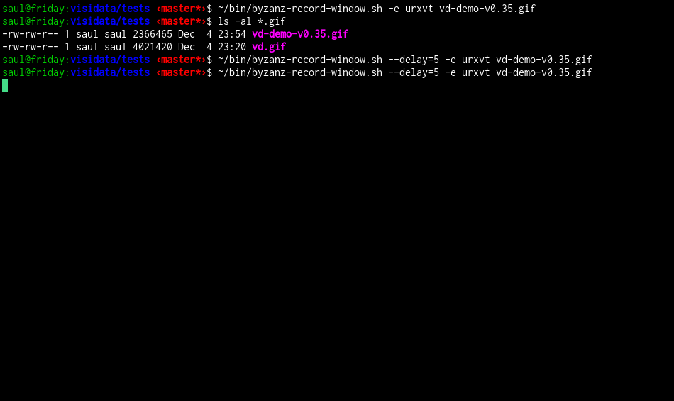

# VisiData v0.37

A curses interface for exploring and arranging tabular data

Usable via any remote shell which has Python3 installed.

## Features
- `F1` for command help sheet
- `o`pen .csv, .tsv, .json, .hdf5, .xlsx
- `Ctrl-S`ave .csv, .tsv
- `hjkl` cursor movement, `t`op/`m`iddle/`b`ottom scroll to position screen cursor
- `[`/`]` sort asc/desc by one column
- `e`dit cell contents
- search/select/unselect/subst by regex in column
- `F`requency table for current column with histogram
- inner/outer/full/diff joins on any number of sheets, matching designated key columns
- add new column by Python expression
- `Ctrl-O` to eval an expression and browse the result as a python object

### Metasheets

- `S`heets metasheet to manage/navigate multiple sheets
- `C`olumns metasheet
- `O`ptions sheet to change the style or behavior
- `E`rror metasheet

### Columns

On the `C`olumns sheet, these commands apply to rows (the columns of the source sheet), instead of the columns on the Columns sheet

- `-` hides column (sets width to 0)
- `_` maximizes column width to fit longest value
- `!` marks column as a key column (pins to the left and matches on sheet joins)

#### Column typing

- columns start out untyped (unless the source data is typed)
   - `#` sets column type to int
   - `$` sets column type to str
   - `%` sets column type to float
   - `@` sets column type to date
   - `~` autodetects column type
- all values are stored in their original format, and only converted on demand and as needed.
- values that can't be properly converted are flagged with `~` on the display
- for commands like sort which require a correctly typed value, the default (0) value for that type is used
- cell edits are rejected if they don't convert to the column type

## Installation

Copy the bin/vd script to a directory in PATH and make it executable.

        $ curl -L saul.pw/vd > vd
        $ chmod u+x ./vd

### Dependencies

- Python 3.3
- openpyxl (if opening .xlsx files)
- h5py and numpy (if opening .hdf5 files)
- google-api-python-client (if opening Google Sheets; must [also set up OAuth credentials](https://developers.google.com/sheets/quickstart/python )
- dateutil.parser (if converting string column to datetime)

**Remember to install the Python3 versions of these modules with e.g. `pip3`**

## Usage

        $ vd [-r/--readonly] [<input> ...]

Inputs may be paths or URLs.  If no inputs are given, starts exploring the
current directory.  Unknown filetypes are by default viewed with a text
browser.

### Commands

Definitions of terms:

- 'go': move cursor
- 'move': change layout of visible data
- 'show': put on status line
- 'scroll': change set of visible rows
- 'open': add a new sheet to the front of the sheets list (thus making it immediately visible)
- 'jump': change to existing sheet
- 'pop': drop sheet
- 'this': current [row/column/cell]
- 'abort': exit program immediately

`F1` opens the Help Sheet, which shows the available commands along with a brief description.
This sheet can be searched, sorted, and filtered just like any other sheet.

Here are slightly better descriptions of some non-obvious commands:

- the "`g`lobal prefix": always applies to the next command only, but could mean "apply to all columns" (as with the regex search commands) or "apply to selected rows" (as with `d`elete) or "apply to all sheets" (as with `q`).
The global\_action column on the Help Sheet shows the specific way the global prefix changes each command.

- `=` "add column expression" takes a Python expression as input and appends a new column, which evaluates the
expression over the row.

- `:` regex subst: creates a new column from an expression, a pattern, and a subst template: `:column/(.*)/\1`

- `Ctrl-S`ave sheet: the output type is determined by the file extension (currently .tsv and .csv)

- `R` sets the source type of the current sheet.  The current sheet remains until a reload (`Ctrl-R`).

- When sheets are joined, the rows are matched by the display values in the key columns.  Different numbers of key columns cannot match (no partial keys and rollup yet).  The join types are:
    - `&`: Join all selected sheets, keeping only rows which match keys on all sheets (inner join)
    - `+`: Join all selected sheets, keeping all rows from first sheet (outer join, with the first selected sheet being the "left")
    - `*`: Join all selected sheets, keeping all rows from all sheets (full join)
    - `~`: Join all selected sheets, keeping only rows NOT in all sheets (diff join)

- Edits made to a joined sheet are by design automatically reflected back to the source sheets.

## Credits/Contributions

VisiData was created by Saul Pwanson `<vd@saul.pw>`.

VisiData is currently under active development (as of December 2016).

VisiData needs lots of usage and testing to help it become useful and dependable.  If you are actively using VisiData, please let me know!  Especially if you like it.  Maybe there is an easy way to improve the tool for both of us.

Also please create a GitHub issue if anything doesn't appear to be working right.
If you get an unexpected error (on the status line), please include the full stack trace that you get with `E`.

Please contact me at the email address above if you would like to contribute in some other way.

## Inspirations and Related Work

- [VisiCalc](http://danbricklin.com/visicalc.htm)
- [BurntSushi/xsv](https://github.com/BurntSushi/xsv)
- [teapot](https://www.syntax-k.de/projekte/teapot/)
- [firecat53/tabview](https://github.com/firecat53/tabview)
- [andmarti1424/sc-im](https://github.com/andmarti1424/sc-im)
- [jennybc/sanesheets](https://github.com/jennybc/sanesheets)
- [Tidy Data](http://vita.had.co.nz/papers/tidy-data.pdf)
- [How to share data with a statistician](https://github.com/jtleek/datasharing)

## License

VisiData is licensed under GPLv3.

